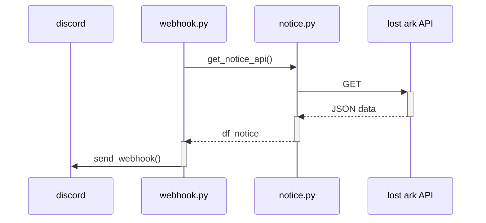

---
tags:
  - python
title: LOST ARK NOTICE BOT
author: Junho Kim (wnsgh9804@outlook.com)
---
# LOST ARK NOTICE BOT
공지사항이 올라오면 주어진 webhook 주소로 공지 전달

![[README 2024-07-18 16.37.18.excalidraw|1000]]
## Description

###  `notice.py`
 * `get_notice_code(url)`
    
    현재 목록에 있는 공지사항 게시글 코드를 추출
 * `get_notice(code)`

    주어진 코드의 공지에서 종류, 제목, 내용을 추출

### | `webhook.py`
* dotenv 패키지 통해 .env로 credential 관리
* `make_embed(code)`

    공지 내용을 emb로 wrap하여 반환
* `send_webhook(emb)`

    emb를 주어진 링크로 전송

    

### | `status_flask.py` 

* webhook.py의 동작상태를 저장, 웹페이지로 전달함
* [[HomeAssistant]]에서 파싱받기 위함
* 미구현

### | `requirements.txt`
 `pip -r installl requirements.txt`을 통해 종속성 패키지 설치

### | `code`
 마지막으로 전송한 공지의 코드 저장

## TODO
- [x] `request` 사용하여 데이터 파싱
- [x] csv 저장 및 관리
    - 그냥 텍스트로 할까
    - [[Dataframe]]으로 처리함
- [x] 메세지 wrap 하기
- [x] discord webhook으로 post
- [ ] telegram 알림
- [x] crontab 사용하여 주기적인 작동
    - 해야할까? -> 해야함

## etc
내 채권봇이랑 공지알림봇 소스들 어디감? 

로스트아크 공지사항은 동적인가 정적인가

## Reference
[Discord Python Package](https://discordpy.readthedocs.io/en/stable/api.html)

